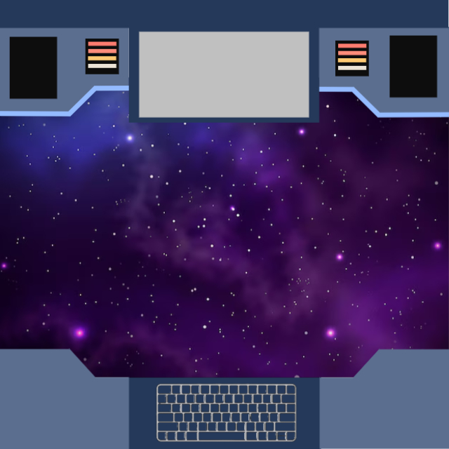

<!-- PROJECT SHIELDS -->
[![Contributors][contributors-shield]][contributors-url]
[![Forks][forks-shield]][forks-url]
[![Stargazers][stars-shield]][stars-url]
[![Issues][issues-shield]][issues-url]
[![MIT License][license-shield]][license-url]

<!-- PROJECT LOGO -->
 

  

  <h3 align="center">Exo-Team solution</h3>

  

    The educational solution enhanced for Android AR.
  

<!-- TABLE OF CONTENTS -->

  
Table of Contents

  <ol>
    <li>
      <a href="#about-the-project">About The Project</a>
      <ul>
        <li><a href="#built-with">Built With</a></li>
      </ul>
    </li>
    <li>
      <a href="#getting-started">Getting Started</a>
      <ul>
        <li><a href="#prerequisites">Prerequisites</a></li>
        <li><a href="#installation">Installation</a></li>
      </ul>
    </li>
    <li><a href="#usage">Usage</a></li>
    <li><a href="#roadmap">Roadmap</a></li>
    <li><a href="#contributing">Contributing</a></li>
    <li><a href="#license">License</a></li>
    <li><a href="#contact">Contact</a></li>
    <li><a href="#acknowledgments">Acknowledgments</a></li>
  </ol>

<!-- ABOUT THE PROJECT -->
## About The Project

Exo-Team developed an augmented reality application where the user can select an exoplanet from an extensive list to visualize the nearest stars around the planet from the mobile device's screen. The user can choose stars and connect them to form and draw constellations. With this application, students worldwide can interact and play with stars from different exoplanets' perspectives to learn about each astronomical body with the simple use of an Android device.

(<a href="#readme-top">back to top</a>)

### Built With

* [![unity][Unity]][unity-url]
* [![fast-api][fast-api]][fast-api-url]

(<a href="#readme-top">back to top</a>)

<!-- GETTING STARTED -->
## Getting Started

To setup this project locally you need to download the unity project located in the [scripts](https://github.com/EstherRamC/exo-team/blob/main/Scripts/ExoTeamProject.unitypackage).

<!-- LICENSE -->
## License

Distributed under the MIT License. See `LICENSE.txt` for more information.

(<a href="#readme-top">back to top</a>)

<!-- CONTACT -->
## Contact

Your Name - [@your_twitter](https://twitter.com/your_username) - email@example.com

Project Link: [https://github.com/your_username/repo_name](https://github.com/your_username/repo_name)

(<a href="#readme-top">back to top</a>)

<!-- ACKNOWLEDGMENTS -->
## Acknowledgments

* [NASA Space Apps](https://www.spaceappschallenge.org/)
* [GAIA DR3 Catalog](https://www.cosmos.esa.int/web/gaia/data-release-3)
* [NASA Exoplanet Archive](https://exoplanetarchive.ipac.caltech.edu/)

(<a href="#readme-top">back to top</a>)

<!-- MARKDOWN LINKS & IMAGES -->
<!-- https://www.markdownguide.org/basic-syntax/#reference-style-links -->
[contributors-shield]: https://img.shields.io/github/contributors/EstherRamC/exo-team?style=for-the-badge
[contributors-url]: https://github.com/EstherRamC/exo-team/graphs/contributors
[forks-shield]: https://img.shields.io/github/forks/EstherRamC/exo-team?style=for-the-badge
[forks-url]: https://github.com/EstherRamC/exo-team/network/members
[stars-shield]: https://img.shields.io/github/stars/EstherRamC/exo-team?style=for-the-badge
[stars-url]: https://github.com/EstherRamC/exo-team/stargazers
[issues-shield]: https://img.shields.io/github/issues/EstherRamC/exo-team?style=for-the-badge
[issues-url]: https://github.com/EstherRamC/exo-team/issues
[license-shield]: https://img.shields.io/github/license/EstherRamC/exo-team?style=for-the-badge
[license-url]: https://github.com/EstherRamC/exo-team/blob/master/LICENSE.txt
[fast-api]: https://img.shields.io/badge/fastapi-009688?style=for-the-badge&logo=fastapi&logoColor=white
[fast-api-url]: https://fastapi.tiangolo.com/
[unity]: https://img.shields.io/badge/unity-000000?style=for-the-badge&logo=unity
[unity-url]: https://unity.com/
